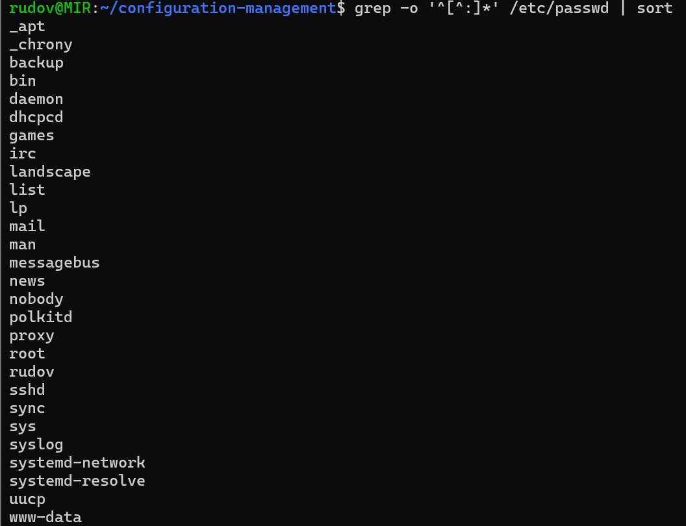
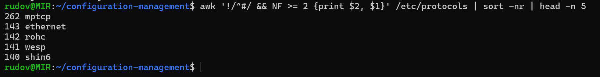
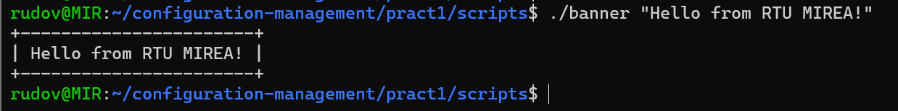
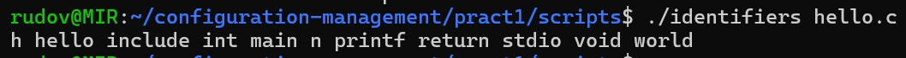
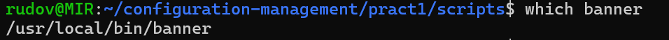
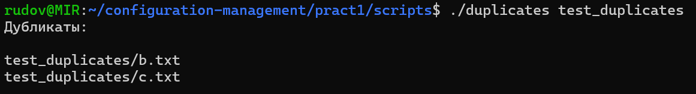
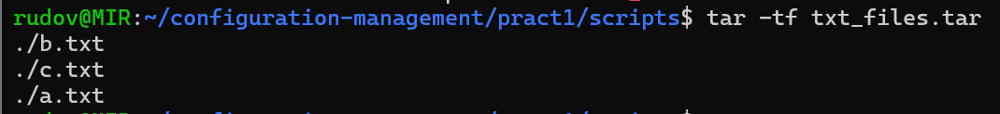
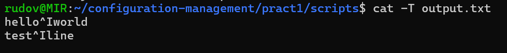
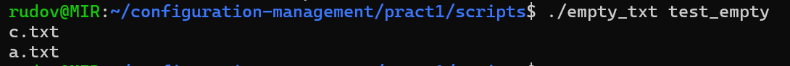

# Практическая работа №1

**Дисциплина:** Конфигурационное управление

**Тема:** Введение. Основы работы в командной строке

**Студент:** Рудов Матвей Иванович

**Группа:** ИКБО-16-25

---

## Цель работы

Изучить основы работы в командной строке Linux,
освоить основные команды и научиться создавать
сценарии Bash.

## Ход работы

### Задание 1

**Условие:**

Вывести отсортированный в алфавитном порядке список имён пользователей из файла `/etc/passwd`.

**Решение:**

Для получения имён пользователей и их сортировки была использована команда:

```bash
grep -o '^[^:]*' /etc/passwd | sort
```



### Задание 2

**Условие:**

Вывести данные из файла `/etc/protocols` в отформатированном и отсортированном порядке для 5 протоколов с наибольшими номерами.

**Решение:**

Была использована команда:

```bash
awk '!/^#/ && NF >= 2 {print $2, $1}' /etc/protocols | sort -nr | head -n 5
```
**Результат:**



### Задание 3

**Условие:**

Написать программу `banner` средствами Bash для вывода переданного текста в рамке. Размер рамки должен автоматически изменяться в зависимости от длины текста.

**Ход выполнения:**

Для хранения программ практической работы была создана папка `scripts`:

```bash
mkdir -p scripts
cd scripts
```

После этого был создан файл программы `banner` с помощью текстового редактора `nano`:

```bash
nano banner
```

В файл был записан следующий Bash-скрипт:

```bash
#!/bin/bash

text="$*"
length=${#text}

border=$(printf '%*s' "$((length + 2))" '' | tr ' ' '-')

echo "+$border+"
echo "| $text |"
echo "+$border+"
```

После сохранения файла ему было добавлено право на выполнение:

```bash
chmod +x banner
```

**Результат:**



### Задание 4

**Условие:**

Написать программу для вывода всех идентификаторов по правилам C/C++ или Java из переданного файла без повторений.

**Ход выполнения:**

Для решения задачи был создан Bash-скрипт `identifiers`.

```bash
nano identifiers
```

В файл был записан следующий код:

```bash
#!/bin/bash

if [ "$#" -ne 1 ]; then
    echo "Использование: $0 <файл>"
    exit 1
fi

grep -oE '[A-Za-z_][A-Za-z0-9_]*' "$1" | sort -u | tr '\n' ' '
echo
```

После сохранения скрипту было добавлено право на выполнение:

```bash
chmod +x identifiers
```

Для проверки программы был создан тестовый файл `hello.c`:

```c
#include <stdio.h>

int main(void) {
    int n = 0;
    printf("hello world");
    return n;
}
```

Программа была запущена командой:

```bash
./identifiers hello.c
```

**Результат:**


### Задание 5

**Условие:**

Написать программу для регистрации пользовательской команды с проверкой прав доступа и копированием её в `/usr/local/bin`.

**Ход выполнения:**

Для решения задачи был создан Bash-скрипт `reg`:

```bash
nano reg
```

В файл был записан следующий код:

```bash
#!/bin/bash

if [ "$#" -ne 1 ]; then
    echo "Использование: $0 <команда>"
    exit 1
fi

command_name="$1"

if [ ! -f "$command_name" ]; then
    echo "Ошибка: файл '$command_name' не найден"
    exit 1
fi

if [ ! -x "$command_name" ]; then
    echo "Ошибка: файл '$command_name' не является исполняемым"
    exit 1
fi

sudo cp "$command_name" /usr/local/bin/

echo "Команда '$command_name' зарегистрирована"
```

После сохранения файлу было добавлено право на выполнение:

```bash
chmod +x reg
```

Для проверки программы была зарегистрирована созданная ранее команда `banner`:

```bash
./reg banner
```

После успешного выполнения программа вывела сообщение:

```text
Команда 'banner' зарегистрирована
```

Для проверки места установки была выполнена команда:

```bash
which banner
```

Ожидаемый результат:

```text
/usr/local/bin/banner
```

**Результат:**



### Задание 6

**Условие:**

Написать программу для проверки наличия комментария в первой строке файлов с расширением `.c`, `.js` и `.py`.

**Ход выполнения:**

Для решения задачи был создан Bash-скрипт `check_comment`.

```bash
nano check_comment
```

В файл был записан следующий код:

```bash
#!/bin/bash

if [ "$#" -ne 1 ]; then
    echo "Использование: $0 <файл>"
    exit 1
fi

file="$1"

if [ ! -f "$file" ]; then
    echo "Ошибка: файл не найден"
    exit 1
fi

first_line=$(head -n 1 "$file")

case "$file" in
    *.py)
        if [[ "$first_line" =~ ^[[:space:]]*# ]]; then
            echo "Комментарий в первой строке есть"
        else
            echo "Комментария в первой строке нет"
        fi
        ;;
    *.c|*.js)
        if [[ "$first_line" =~ ^[[:space:]]*// || "$first_line" =~ ^[[:space:]]*/\* ]]; then
            echo "Комментарий в первой строке есть"
        else
            echo "Комментария в первой строке нет"
        fi
        ;;
    *)
        echo "Неподдерживаемое расширение файла"
        ;;
esac
```

После сохранения скрипту было добавлено право на выполнение:

```bash
chmod +x check_comment
```

Для проверки был создан тестовый файл `test.py`:

```python
# это комментарий
print("Hello")
```

После этого программа была запущена:

```bash
./check_comment test.py
```

**Результат:**


### Задание 7

**Условие:**

Написать программу для поиска файлов-дубликатов по заданному пути, включая вложенные директории.

**Ход выполнения:**

Для решения задачи был создан Bash-скрипт `duplicates`:

```bash
nano duplicates
```

В файл был записан следующий код:

```bash
#!/bin/bash

if [ "$#" -ne 1 ]; then
    echo "Использование: $0 <путь>"
    exit 1
fi

path="$1"

if [ ! -d "$path" ]; then
    echo "Ошибка: директория не найдена"
    exit 1
fi

find "$path" -type f -exec sha256sum {} + | sort | awk '
{
    hash=$1
    $1=""
    sub(/^ /, "")
    files[hash]=files[hash] "\n" $0
    count[hash]++
}
END {
    for (hash in count) {
        if (count[hash] > 1) {
            print "Дубликаты:"
            print files[hash]
            print ""
        }
    }
}'
```

После сохранения скрипту было добавлено право на выполнение:

```bash
chmod +x duplicates
```

Для проверки была создана тестовая директория:

```bash
mkdir -p test_duplicates
```

В неё были добавлены три файла:

```bash
echo "different" > test_duplicates/a.txt
echo "hello" > test_duplicates/b.txt
echo "hello" > test_duplicates/c.txt
```

Содержимое файлов:

```text
a.txt -> different
b.txt -> hello
c.txt -> hello
```

После этого программа была запущена командой:

```bash
./duplicates test_duplicates
```

**Результат:**



### Задание 8

**Условие:**

Написать программу, которая находит все файлы в текущем каталоге с расширением, указанным в качестве аргумента, и архивирует их в архив формата `tar`.

**Ход выполнения:**

Для решения задачи был создан Bash-скрипт `archive_ext`:

```bash
nano archive_ext
```

В файл был записан следующий код:

```bash
#!/bin/bash

if [ "$#" -ne 1 ]; then
    echo "Использование: $0 <расширение>"
    exit 1
fi

ext="$1"
archive="${ext}_files.tar"

files=$(find . -maxdepth 1 -type f -name "*.$ext")

if [ -z "$files" ]; then
    echo "Файлы с расширением .$ext не найдены"
    exit 1
fi

tar -cf "$archive" $files

echo "Создан архив: $archive"
```

После сохранения скрипту было добавлено право на выполнение:

```bash
chmod +x archive_ext
```

Для проверки были созданы тестовые файлы:

```bash
echo "one" > a.txt
echo "two" > b.txt
echo "three" > c.txt
echo "code" > test.c
```

После этого программа была запущена для файлов с расширением `.txt`:

```bash
./archive_ext txt
```

**Результат:**

Был создан архив:

```text
txt_files.tar
```

Проверка содержимого архива выполнялась командой:

```bash
tar -tf txt_files.tar
```



### Задание 9

**Условие:**

Написать программу, которая заменяет в файле последовательности из 4 пробелов на символ табуляции. Входной и выходной файлы задаются аргументами программы.

**Ход выполнения:**

Для решения задачи был создан Bash-скрипт `spaces_to_tabs`:

```bash
nano spaces_to_tabs
```

В файл был записан следующий код:

```bash
#!/bin/bash

if [ "$#" -ne 2 ]; then
    echo "Использование: $0 <входной_файл> <выходной_файл>"
    exit 1
fi

input="$1"
output="$2"

if [ ! -f "$input" ]; then
    echo "Ошибка: входной файл не найден"
    exit 1
fi

sed $'s/    /\t/g' "$input" > "$output"

echo "Готово. Результат записан в $output"
```

После сохранения скрипту было добавлено право на выполнение:

```bash
chmod +x spaces_to_tabs
```

Для проверки был создан тестовый файл `input.txt`, содержащий строки с четырьмя пробелами между словами:

```text
hello    world
test    line
```

Программа была запущена командой:

```bash
./spaces_to_tabs input.txt output.txt
```

Для проверки наличия символов табуляции была использована команда:

```bash
cat -T output.txt
```

Она отображает символ табуляции как `^I`.

**Результат:**



### Задание 10

**Условие:**

Написать программу, которая выводит имена всех пустых текстовых файлов в указанной директории.

**Ход выполнения:**

Для решения задачи был создан Bash-скрипт `empty_txt`:

```bash
nano empty_txt
```

В файл был записан следующий код:

```bash
#!/bin/bash

if [ "$#" -ne 1 ]; then
    echo "Использование: $0 <директория>"
    exit 1
fi

dir="$1"

if [ ! -d "$dir" ]; then
    echo "Ошибка: директория не найдена"
    exit 1
fi

find "$dir" -maxdepth 1 -type f -name "*.txt" -empty -printf "%f\n"
```

После сохранения скрипту было добавлено право на выполнение:

```bash
chmod +x empty_txt
```

Для проверки была создана тестовая директория:

```bash
mkdir -p test_empty
```

В ней были созданы два пустых текстовых файла:

```bash
touch test_empty/a.txt
touch test_empty/c.txt
```

Также был создан один непустой файл:

```bash
echo "hello" > test_empty/b.txt
```

После этого программа была запущена:

```bash
./empty_txt test_empty
```

**Результат:**

Программа успешно вывела имена пустых текстовых файлов:
Файл `b.txt` не был выведен, так как он содержит текст.


